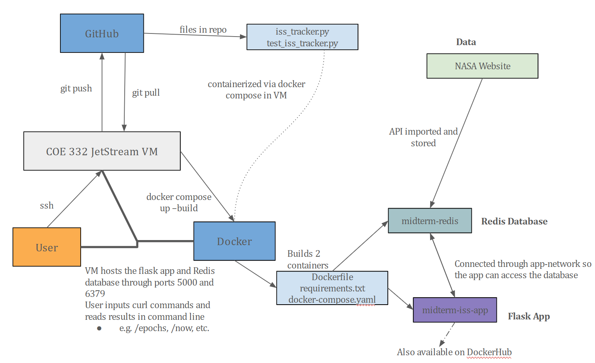

# ISS Tracking Flask App
## The Sands of Midterm - Overview

This directory/project builds on previous assignments to create a Flask web application that fetches data about the ISS's trajectory from NASA and stores it in a Redis database. The user uses various curl commands with different endpoints (detailed below) to see information. Everything is containerized and runs via Docker

The data can be downloaded from the [ISS Trajectory Data](https://spotthestation.nasa.gov/trajectory_data.cfm) page, or you can follow the instructions below for using the requests library to import it as a part of the script. More info in the **About the Data** section.

## Setting Up
Follow these steps to set up the Docker containers for testing

1. If applicable, run `git clone https://github.com/ssinghal37/singhal-coe332-midterm.git`
2. Ensure Docker is installed correctly with `docker --version`. Assuming those testing these are using the TACC Virtual Machine, you should be good to go
3. Since this repo includes a docker-compose.yml, we can simply do `docker compose up --build`. This will use docker-compose.yml, Dockerfile, and requirements.txt to set up two containers. The first one is the Redis database, and the second the iss-tracker app
4. Now the container is running. You can either open a new tab at this point or redo step 3 but add the detach flag: `docker compose up -d --build`
5. You may now run tests. For detailed info about the available routes/endpoints, see the **Running Curl Endpoints** section
6. To run pytest and ensure everything is working correctly, run `docker exec -it midterm-iss-app pytest test_iss_tracker.py`
7. Once you are done, run `docker compose down` to stop and close the containers
## About the Data
The data is imported from the ISS trajectory data URL, but is then dumped into a Redis database. This allows us to avoid making repeated calls to the API to gather data and instead take it in from a local source. This is more efficient and less risky. From the command line (once the containers are running), you can check this Redis database with the following:

`docker exec -it midterm-redis redis-cli`
This opens up the Redis CLI, and you can enter in `KEYS *` which should show you "iss_data". Running `GET iss_data` will output all of the data stored inside this database

Run `exit` to return to your command line
## File Summary
This directory includes the following files:
### iss_tracker.py
- Ingests NASA's ISS trajectory data and stores it within a defined Redis database. This is done in a persistent manner so that upon closing and reopening an instance of the image, the data will still be there
- This database contains several epochs, each containing an epoch date and timestamp, a position (X, Y, Z), and velocity in three directions (X_DOT, Y_DOT, Z_DOT)
- Has a file URL coded in, but that URL can be replaced with an updated XML from the same ISS trajectory data page. This most likely will not need to be done as the URL auto-updates
- Includes some helper functions:
    - *store_iss_data* uses the requests library to convert xml data from the ISS data URL into a Python list, which is then mounted into a Redis database
    - *get_data* simply returns the database. If the database hasn't been created yet, it runs *store_iss_data* and then returns the data
    - *speed* takes in three floats and outputs their resultant magnitude
    - *xyz_to_lat_lon* takes in Cartesian XYZ coordinates and converts it to latitude and longitude, returning those two values in degrees
- Includes functions for displaying the proper info for the available routes/endpoints
- Does not output anything by being run. See the **Running Curl Endpoints** section for instructions on running and testing the different routes and endpoints
- Reading the output should be pretty self explanatory, as it is accompanied with text explaining which numbers are what.

### test_iss_tracker.py
- Utilizes pytest to ensure the functions within iss_tracker.py are working as expected
- Sets up a test client to test the different endpoints and that they return a successful status code of 200
### Dockerfile
- Builds the docker image
### requirements.txt
- Gives Dockerfile specific libraries to install for proper execution 
### docker-compose.yml
- Allows us to use docker compose up/down
- Makes starting/stopping the container(s) much easier as this file takes cares of all the inputs, dependencies, ports, etc.
### diagram.png
- Highlighted in the **Software Diagram** section
### README.md
- What you are reading right now
## Running Curl Endpoints
From the command line, if your docker containers are running, you can run the following curl endpoints. Check if your containers are running with `docker ps`. You should see two, midterm-redis and midterm-iss-app. 

Endpoints are ran using `curl 'localhost:5000<input>`.
Here is a list of the different routes provided for `<input>`:
- /epochs
    - Returns the entire data set
- /epochs?limit=X
    - Limits the data set to the first X entries
- /epochs?limit=X&offset=Y
    - Limits to the first X entries starting at Y
- /epochs/<epoch>
    - Shows the state vectors for a specified epoch
- /epochs/<epoch>/speed
    - Returns the instantaneous speed for a specified epoch
- /epochs/<epoch>/location
    - Returns the latitude, longitude, altitude, and geoposition for a specified epoch
- /now
    - Shows the state vectors, instantaneous speed, latitude, longitude, altitude, and geoposition for the epoch closest to the execution time
    - Based on UTC time. CST in Austin, TX is UTC -6:00 so think of the epoch timestamp as 6 hours in advance of local time
        - Keep in mind that at the time of creation (early March 2025) the US has began daylight savings time, so CDT in Austin, TX is UTC -5:00

## Software Diagram

This diagram shows the relations between various aspects of this entire software setup. There is a strong relation between the user, the VM (or whichever machine is running), and Docker as everything is hosted here, the user inputs curl commands, and reads results in their terminal. 

Depending on how exactly the user runs everything, they may not actually be using Github (Dockerhub instead) or not ssh'ing into a VM first and doing it all locally. 
## Sources
1. [ISS Trajectory Data Home Page](https://spotthestation.nasa.gov/trajectory_data.cfm)
2. [Trajectory Data XML File](https://nasa-public-data.s3.amazonaws.com/iss-coords/current/ISS\_OEM/ISS.OEM\_J2K\_EPH.xml)
3. [COE 332 ReadTheDocs](https://coe-332-sp25.readthedocs.io/en/latest/index.html) as a guide on Flask, Docker, Redis, etc.
4. [Geopy ReadTheDocs](https://geopy.readthedocs.io/en/stable/#)

## Note of AI
For the life of me, I could not figure out why my pytest kept failing. Turns out I misspelled "instantaneous" and it wasn't detecting the right key. ChatGPT pointed out where I wrote *instantaenous* on accident
